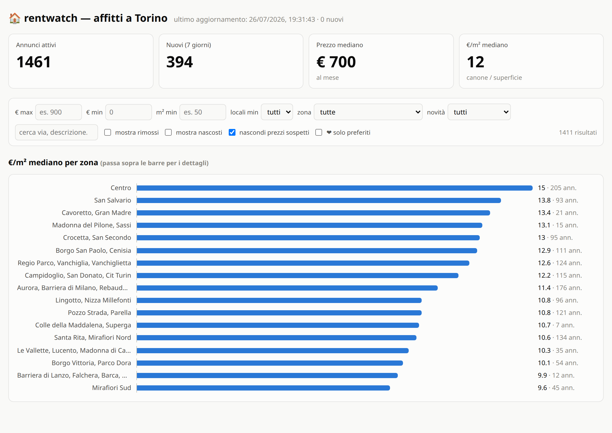

# rentwatch

Monitor degli annunci di **affitto su immobiliare.it**: scarica periodicamente
le inserzioni di una città, le tiene in un database SQLite e le mostra in una
dashboard con €/m², giorni sul mercato, cali di prezzo e statistiche per zona.

Nato da un problema concreto: cercare casa in affitto a Torino significa
ricontrollare a mano centinaia di annunci ogni giorno, senza modo di capire
quali sono nuovi, quali hanno abbassato il prezzo e quali sono già stati
affittati. rentwatch fa quel lavoro e presenta solo la differenza.



## Cosa fa

- **Storico dei prezzi.** Ogni variazione viene registrata: la dashboard mostra
  di quanto è scesa la richiesta rispetto alla prima pubblicazione.
- **Annunci scomparsi.** Un annuncio che non compare più in una scansione
  completa viene marcato come rimosso (probabilmente affittato) ma resta nel
  database — così si vede quanto in fretta va via ciò che è interessante.
- **€/m² per zona.** Mediane per macrozona: il modo più rapido per capire se un
  canone è in linea o fuori mercato.
- **Filtro "novità".** Solo gli annunci apparsi nelle ultime 24 ore / 3 / 7
  giorni: la vista "cosa è cambiato da ieri".
- **Scarta (✕) e preferiti (♥).** Gli annunci scartati non ricompaiono più
  nemmeno dopo gli aggiornamenti; i preferiti restano tracciati anche quando
  vengono ritirati dal portale.
- **Prezzi sospetti.** Molte agenzie per studenti pubblicano la *stanza* come
  appartamento: prezzo a persona, superficie dell'alloggio intero. Un'euristica
  (€/m² < 5, oppure canone/locali < 120 € con 4+ locali) li segnala con un badge
  e li esclude dalle mediane, senza cancellarli: a volte sono davvero
  l'occasione giusta.
- **Report Markdown** rigenerato a ogni scansione, leggibile dal telefono.
- **Notifiche Telegram** configurabili: filtri propri (prezzo, m², locali, zone,
  solo privati), testo del messaggio personalizzabile, ore di silenzio e avvisi
  sui ribassi. Un bot risponde anche ai comandi, da `/stato` a `/preferiti`.
- **Login** sulla dashboard, con più account: sessione firmata, password
  PBKDF2, throttle sui tentativi. Serve per poterla esporre su internet senza
  pubblicare la propria ricerca di casa — e per cercare casa in due.

## Requisiti

Python 3.10+ e tre dipendenze (`curl_cffi`, `fastapi`, `uvicorn`). Su Python
3.10 se ne aggiunge una quarta, `tomli`, perché `tomllib` è entrato nella
libreria standard solo con la 3.11 — pip la installa da sola quando serve.

```bash
git clone https://github.com/Rehd96/rentwatch.git
cd rentwatch
python3 -m venv .venv
.venv/bin/pip install -r requirements.txt
```

## Uso

```bash
.venv/bin/python -m rentwatch set-password          # aggiunge un utente / cambia password
.venv/bin/python -m rentwatch list-users            # chi può entrare
.venv/bin/python -m rentwatch remove-user           # toglie un utente
.venv/bin/python -m rentwatch scrape                # scansione completa
.venv/bin/python -m rentwatch scrape --max-pages 2  # prova veloce
.venv/bin/python -m rentwatch serve                 # dashboard su :8777
.venv/bin/python -m rentwatch report                # solo il report Markdown
.venv/bin/python -m rentwatch telegram-test         # verifica token e chat id
.venv/bin/python -m rentwatch bot                   # risponde ai comandi Telegram
```

La dashboard chiede il login: crea prima un utente con `set-password`. Su un
portatile isolato si può togliere con `[auth] enabled = false`.

### Più di un utente

Ogni persona ha il suo account — utile se cercate casa in due. Ognuno entra con
le proprie credenziali e in alto vede il nome con cui è entrato.

```bash
.venv/bin/python -m rentwatch set-password --username ion
.venv/bin/python -m rentwatch set-password --username elena
.venv/bin/python -m rentwatch list-users
```

`set-password` su un nome che esiste già ne cambia la password; su un nome
nuovo crea l'account. Non sovrascrive mai un utente diverso, così un errore di
battitura in `--username` crea un account di troppo invece di cancellare quello
di un'altra persona (`remove-user` lo toglie). L'ultimo account non si può
rimuovere finché il login è attivo: chiuderebbe fuori tutti.

Il limite sui tentativi è **per indirizzo IP**, non per utente: cinque errori
dalla stessa connessione e si aspettano cinque minuti, chiunque li abbia fatti.
È voluto — contare per utente permetterebbe a un estraneo di bloccare l'accesso
a una persona sbagliando la sua password apposta.

### Preferiti: personali, ma visibili a entrambi

Il ♥ è di chi lo mette. Ognuno ha la sua lista, e sotto ogni annuncio si vede
chi l'ha segnato (`♥ elena`, oppure `♥ elena + ion` quando piace a tutti e
due). Il cuore pieno in tabella è il **tuo**; il bordo rosso senza riempimento
vuol dire che è un preferito dell'altra persona. Togliere il proprio ♥ non
tocca quello di nessun altro.

Il filtro "❤ solo preferiti" mostra i preferiti di tutti: la lista è condivisa,
e una casa che è piaciuta a uno non deve sparire dai filtri dell'altro.

Su Telegram:

```
/preferiti          tutti i preferiti, con chi li ha segnati
/preferiti elena    solo quelli di una persona
/stato              conteggio dei ♥ per utente
```

I ♥ messi prima che esistessero gli account vengono assegnati al primo utente
in configurazione — erano di qualcuno, e quello è l'unico nome plausibile.

Il ✕ "nascondi", invece, resta **condiviso**: scartare una casa è una decisione
di entrambi, non un gusto personale.

La prima scansione popola il database senza inviare notifiche (sarebbe uno
sciame di messaggi per l'intero mercato); dalla seconda in poi segnala solo le
novità reali. La marcatura degli annunci rimossi avviene **solo** sulle
scansioni complete: con `--max-pages` non sparire dai risultati non significa
niente.

## Configurazione

`config.toml` definisce una o più ricerche con gli stessi parametri che
immobiliare.it usa nei propri URL:

```toml
[[searches]]
name = "Torino - affitti fino a 1000€, min 40 m²"
path = "/affitto-case/torino/"

[searches.params]
prezzoMassimo = 1000
superficieMinima = 40
# localiMinimo = 2
# idMZona[] = [...]        # macrozone
```

Per un'altra città servono `idComune` (e affini) di quella città: si leggono
dall'URL di una ricerca fatta sul sito. Torino è `idComune=9987`; affitto è
`idContratto=2`, residenziale `idCategoria=1`.

Le modifiche personali vanno in `config.local.toml` (ha la precedenza ed è in
`.gitignore`) — è anche il posto giusto per il token Telegram, che così non
finisce mai in un commit.

Ricerche, filtri di notifica e impostazioni Telegram si modificano anche dalla
pagina **Impostazioni** della dashboard, che scrive lei `config.local.toml`.

### Telegram (opzionale)

1. Crea un bot con [@BotFather](https://t.me/BotFather) e prendi il token.
2. **Apri il bot e premi Start.** Il link `t.me/<nome_bot>` è già nel messaggio
   con cui BotFather conferma la creazione: basta toccarlo, senza cercare il
   bot a mano. Un bot non può scrivere per primo: finché non gli mandi un
   messaggio la chat non esiste e l'invio risponde `chat not found`.
3. Ricava il chat id con `python -m rentwatch telegram-chat-id`, che elenca le
   chat che hanno scritto al bot leggendole dall'API. Un id `private` è
   positivo (messaggi diretti a te); canali e gruppi sono negativi e iniziano
   con `-100`, e lì il bot va aggiunto come amministratore.
4. Incollali nella pagina Impostazioni e premi "invia messaggio di prova",
   oppure a mano in `config.local.toml`:

### Notifiche a più persone

Ogni destinatario riceve tutte le notifiche. Chi deve riceverle apre il bot e
preme **Start** una volta — un bot non può scrivere per primo — poi:

```bash
.venv/bin/python -m rentwatch telegram-chat-id                     # gli id
.venv/bin/python -m rentwatch telegram-add-chat --chat-id 222 --user elena
.venv/bin/python -m rentwatch telegram-test                        # prova, uno per uno
```

Dalla pagina Impostazioni c'è la stessa cosa, col pulsante "Chi ha scritto al
bot?" che propone gli id senza doverli copiare a mano.

`--user` è facoltativo: collega la chat a un account della dashboard, così
`/preferiti miei` risponde con i preferiti di chi ha scritto. In alternativa a
due chat separate si può usare **un gruppo** con dentro entrambi e il bot: vale
come destinatario singolo, con id negativo.

`telegram-test` prova ogni destinatario separatamente e dice chi non ha
ricevuto: con due persone configurate, "ha funzionato" non serve a niente se il
messaggio è arrivato a una sola. Allo stesso modo una chat rotta non blocca
l'invio agli altri.

```toml
[telegram]
enabled = true
bot_token = "…"
quiet_hours_start = 23     # niente messaggi di notte: restano in coda
quiet_hours_end = 8
template = "🏠 {title}\n💶 {price} · {surface}{ppm2}\n📍 {zone}\n{url}"

[[telegram.recipients]]
chat_id = "111111"
user = "ion"

[[telegram.recipients]]
chat_id = "222222"
user = "elena"

[telegram.filters]
price_max = 900            # notifica solo sotto questa soglia
surface_min = 45
zones = ["Vanchiglia", "San Salvario"]
```

I filtri valgono **solo per le notifiche**: la dashboard continua a mostrare
tutto il mercato. Con `python -m rentwatch bot` attivo puoi anche chiedere le
cose dal telefono: `/stato`, `/ultimi`, `/preferiti`, `/filtri`, `/prezzo 850`,
`/silenzia`. Il bot risponde soltanto alle chat elencate nei destinatari:
chiunque altro trovi il bot viene ignorato.

## Come funziona

| File | Ruolo |
|---|---|
| `rentwatch/scraper.py` | client dell'API JSON interna del portale |
| `rentwatch/db.py` | schema SQLite, upsert, storico prezzi, migrazioni |
| `rentwatch/web.py` + `static/index.html` | dashboard FastAPI + single-page |
| `rentwatch/report.py` | snapshot Markdown |
| `rentwatch/notify.py` | notifiche Telegram: filtri, template, ore di silenzio |
| `rentwatch/bot.py` | comandi Telegram (long-poll, niente webhook) |
| `rentwatch/auth.py` | password PBKDF2 e cookie di sessione firmato |
| `rentwatch/settings_store.py` | scrive `config.local.toml` dalla dashboard |

Nessun parsing HTML: il sito alimenta le proprie pagine di ricerca con un
endpoint JSON (`/api-next/search-list/listings/`, gli stessi dati che stanno in
`__NEXT_DATA__`), quindi i campi arrivano già strutturati — prezzo, superficie,
locali, piano, ascensore, coordinate, agenzia.

### Note sull'API (scoperte sul campo)

Dettagli che costano tempo scoprire da soli:

- **`paramsCount` è obbligatorio.** Senza quel parametro nella query l'endpoint
  risponde `500`.
- **Massimo 2000 risultati (80 pagine) per ricerca.** Da `pag=81` la risposta è
  `HTTP 418`, con qualunque sessione o indirizzo IP: è un limite del backend,
  non un rate limit, e il campo `maxPages` dichiara più pagine di quelle che
  vengono davvero servite. Riprovare o attendere non serve. rentwatch aggira il
  limite partizionando automaticamente la ricerca in fasce di prezzo, ognuna
  sotto le 2000 unità.
- **Un client HTTP normale riceve `403`**: il controllo avviene sul TLS
  fingerprint, per questo il progetto usa
  [curl_cffi](https://github.com/lexiforest/curl_cffi) con impersonazione del
  browser. Nessun captcha, nessun proxy.

## Automazione

Unit systemd pronte in `deploy/`: scansione **ogni 4 ore** (00/04/08/12/16/20,
con jitter), dashboard sempre attiva, bot opzionale.

```bash
mkdir -p ~/.config/systemd/user
cp deploy/rentwatch-*.{service,timer} ~/.config/systemd/user/
systemctl --user daemon-reload
systemctl --user enable --now rentwatch-scrape.timer
systemctl --user enable --now rentwatch-web.service
systemctl --user enable --now rentwatch-bot.service   # opzionale
```

Per cambiare la cadenza si modifica `OnCalendar` in
`deploy/rentwatch-scrape.timer` (la chiave `[schedule] every_hours` nel config
è solo documentazione, non muove il timer).

### Su un VPS, dietro nginx

`VPS_COMMANDS.txt` contiene la procedura completa passo per passo: la dashboard
finisce sotto un prefisso (`/case/`) accanto agli altri siti dello stesso
dominio, con `proxy_pass http://127.0.0.1:8777/;` e `--root-path /case`. La
porta resta su loopback, e l'autenticazione è quella dell'app: vale anche per
chi arrivasse alla 8777 senza passare da nginx.

`deploy/vps/` contiene in più uno scaffold Docker **mai testato**, alternativo
a systemd. Da valutare anche il blocco degli IP datacenter da parte del
portale, più sospetti di una connessione residenziale.

## Limiti noti

- Un solo portale (immobiliare.it). Per le sole notifiche multi-portale esiste
  [flathunter](https://github.com/flathunters/flathunter), che copre anche
  Idealista e Subito; rentwatch aggiunge storico prezzi, statistiche e
  dashboard su un portale solo.
- L'API è interna e non documentata: può cambiare senza preavviso. Se succede,
  la struttura dei dati si ritrova in `__NEXT_DATA__` di una pagina di ricerca.
- Nessuna test suite: la verifica è `scrape --max-pages 2` più un colpo d'occhio
  su `/api/overview` (401 senza cookie di sessione, 200 dopo il login).
- Gli account sono tutti uguali: non ci sono ruoli o permessi, chi entra vede e
  modifica tutto. È pensato per due o tre persone che cercano casa insieme, non
  per un'applicazione multi-utente vera.
- Il database (`data/`) e i report generati non sono versionati: contengono i
  tuoi dati di ricerca.

## Licenza

[MIT](LICENSE) — il codice si può riusare, modificare e ridistribuire, con la
sola condizione di mantenere la nota di copyright. La licenza copre il software,
non i dati scaricati: gli annunci restano di immobiliare.it e delle agenzie che
li pubblicano.

## Uso responsabile

Progetto personale, pensato per **una sola persona che cerca casa**. Le
impostazioni predefinite tengono 1,5–3 secondi di pausa tra le richieste e una
sola scansione all'ora: un carico irrilevante per il portale, paragonabile a
qualcuno che sfoglia i risultati. Chi lo riusa è pregato di non alzare quei
ritmi, di non ridistribuire i contenuti scaricati e di ricordare che i dati
appartengono a immobiliare.it e alle agenzie che pubblicano gli annunci.
Nessuna affiliazione con Immobiliare.it Spa.
